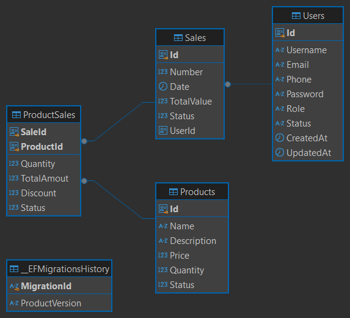

# EXecute process

on `/backend` execute:

```sh
docker compose up -d --build
```

after that open the following link:
* [https://localhost:8081/swagger/index.html](https://localhost:8081/swagger/index.html)

the migration will be directly applied and the table products on the next diagram will be seeded with 6 fake products



to execute use the [Rest Client](https://marketplace.visualstudio.com/items?itemName=humao.rest-client) extension from the visual code and the file [Ambev.DeveloperEvaluation.WebApi.http](../backend/src/Ambev.DeveloperEvaluation.WebApi/Ambev.DeveloperEvaluation.WebApi.http)

On the 4 first line there are the `host_addres`, jwt `token` , `saleId` and `productid` variables.